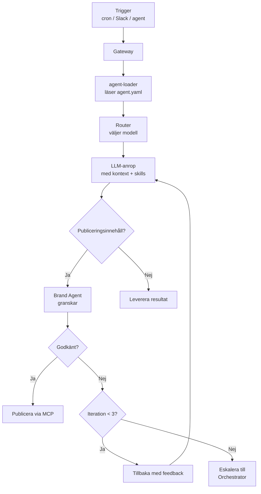

# Agentkluster

FIA har åtta AI-agenter organiserade i kluster. Varje agent har ett specifikt ansvarsområde, definierad autonominivå och ett manifest (`agent.yaml`) som styr beteende, modellval och kontextladdning.

## Agentöversikt

| Agent            | Slug           | Autonomi           | Nyckelansvar                                          |
| ---------------- | -------------- | ------------------ | ----------------------------------------------------- |
| **Strategy**     | `strategy`     | Semi-autonom       | Planering, kvartals-/månadsplaner, veckoplanering     |
| **Intelligence** | `intelligence` | Semi-autonom       | Omvärldsbevakning, trendspaning, morgonscan           |
| **Content**      | `content`      | Autonom            | All textproduktion: blogg, sociala medier, nyhetsbrev |
| **Campaign**     | `campaign`     | Autonom            | Kampanjer, email-sekvenser, annonser                  |
| **SEO**          | `seo`          | Autonom            | Sökoptimering, keyword-analys, SEO-audit              |
| **Lead**         | `lead`         | Autonom            | Lead scoring, nurture-sekvenser                       |
| **Analytics**    | `analytics`    | Autonom            | Rapporter, KPI-tracking, morgonpuls                   |
| **Brand**        | `brand`        | Autonom (vetorätt) | Kvalitetsgranskning av allt innehåll                  |

!!! warning "Brand Agent – vetorätt"
Brand Agent har `has_veto: true` och använder alltid Claude Opus. **Allt innehåll** som ska publiceras passerar Brand Agent för granskning. Vid underkännande skickas feedback tillbaka till producerande agent (max 3 iterationer innan eskalering).

## Agentflöde



## Skill-system

Varje agent har en uppsättning skills som laddas i systemprompt. Skills är modulära markdown-filer som definierar beteende, guardrails och riktlinjer.

### Delade skills (6 st)

| Skill                   | Prefix    | Beskrivning                                  |
| ----------------------- | --------- | -------------------------------------------- |
| `forefront-identity`    | `shared:` | Forefronts varumärkesplattform och identitet |
| `brand-compliance`      | `shared:` | Regler för varumärkesefterlevnad             |
| `swedish-tone`          | `shared:` | Svenskt tonalitetsspråk och stilregler       |
| `data-driven-reasoning` | `shared:` | Datadrivet resonemang och källkrav           |
| `escalation-protocol`   | `shared:` | Protokoll för eskalering till Orchestrator   |
| `gdpr-compliance`       | `shared:` | GDPR-regler och dataskydd                    |

### Agent-specifika skills

Varje agent har dessutom egna skills som definierar agentens specialistkompetens. Dessa refereras med prefix `agent:` i `agent.yaml`.

```yaml
# Exempel: Content Agent
skills:
  - shared:forefront-identity
  - shared:brand-compliance
  - shared:swedish-tone
  - shared:escalation-protocol
  - agent:content-production
  - agent:channel-adaptation
```

## Schemalagda uppgiftstyper

| Agent        | Uppgiftstyp           | Cron                   | Beskrivning                       |
| ------------ | --------------------- | ---------------------- | --------------------------------- |
| Intelligence | `morning_scan`        | `30 6 * * 1-5`         | Morgonscan av nyheter och trender |
| Analytics    | `morning_pulse`       | `0 7 * * 1-5`          | Daglig KPI-sammanfattning         |
| Strategy     | `weekly_planning`     | `0 8 * * 1`            | Veckovis strategiplanering        |
| Content      | `scheduled_content`   | `0 9 * * 1,3,5`        | Schemalagd innehållsproduktion    |
| Intelligence | `weekly_intelligence` | `0 9 * * 1`            | Veckovis underrättelserapport     |
| Lead         | `lead_scoring`        | `0 10 * * *`           | Daglig lead scoring               |
| Intelligence | `midday_sweep`        | `0 13 * * 1-5`         | Middagsscan av nyheter            |
| Analytics    | `weekly_report`       | `0 14 * * 5`           | Veckovis analysrapport            |
| Strategy     | `monthly_planning`    | `0 9 1-7 * 1`          | Månadsplanering (första måndagen) |
| Analytics    | `quarterly_review`    | `0 9 25-31 3,6,9,12 5` | Kvartalsöversikt (sista fredagen) |

!!! tip "Detaljerad referens"
Se [Agentreferens](agents-reference.md) för detaljerad per-agent-information inklusive routing, kontext, verktyg och self-eval-konfiguration.

## Brand Agent

Brand Agent är systemets kvalitetsgrindvakt med unika egenskaper:

- **`has_veto: true`** – Kan underkänna innehåll som inte uppfyller varumärkeskrav
- **Alltid Claude Opus** – Använder den mest kapabla modellen för granskning
- **Granskar allt publiceringsinnehåll** – Inget publiceras utan Brand Agent-godkännande
- **Feedback-loop** – Vid underkännande får producerande agent specifik feedback
- **Eskaleringsprotokoll** – Efter 3 underkännanden eskaleras till Orchestrator

### Granskningskriterier

Brand Agent utvärderar innehåll mot:

1. Forefronts varumärkesplattform och löfte
2. Tonalitetsregler (klok kollega, konkret, nyfiken)
3. Visuell identitet (färger, typsnitt, gradient)
4. Budskapshierarki (nivå 1–3)
5. Faktakontroll och källhänvisning

## Display Status

Alla agenter har en display-status som visas konsekvent i CLI, Dashboard och Slack.

| Status    | Symbol                     | Beskrivning                                  |
| --------- | -------------------------- | -------------------------------------------- |
| `online`  | :material-circle:{.green}  | Agenten är redo och väntar på uppgifter      |
| `working` | :material-circle:{.blue}   | Agenten bearbetar en uppgift                 |
| `paused`  | :material-circle:{.yellow} | Agenten är pausad (manuellt eller av system) |
| `killed`  | :material-circle:{.red}    | Kill switch aktiverad                        |
| `error`   | :material-circle:{.red}    | Agenten har stött på ett fel                 |

!!! info "Resolve-logik"
Display-status beräknas i `src/shared/display-status.ts` baserat på agentens databasstatus, huruvida kill switch är aktiv, och senaste heartbeat. Logiken är delad mellan gateway, CLI och Dashboard för konsistens.
