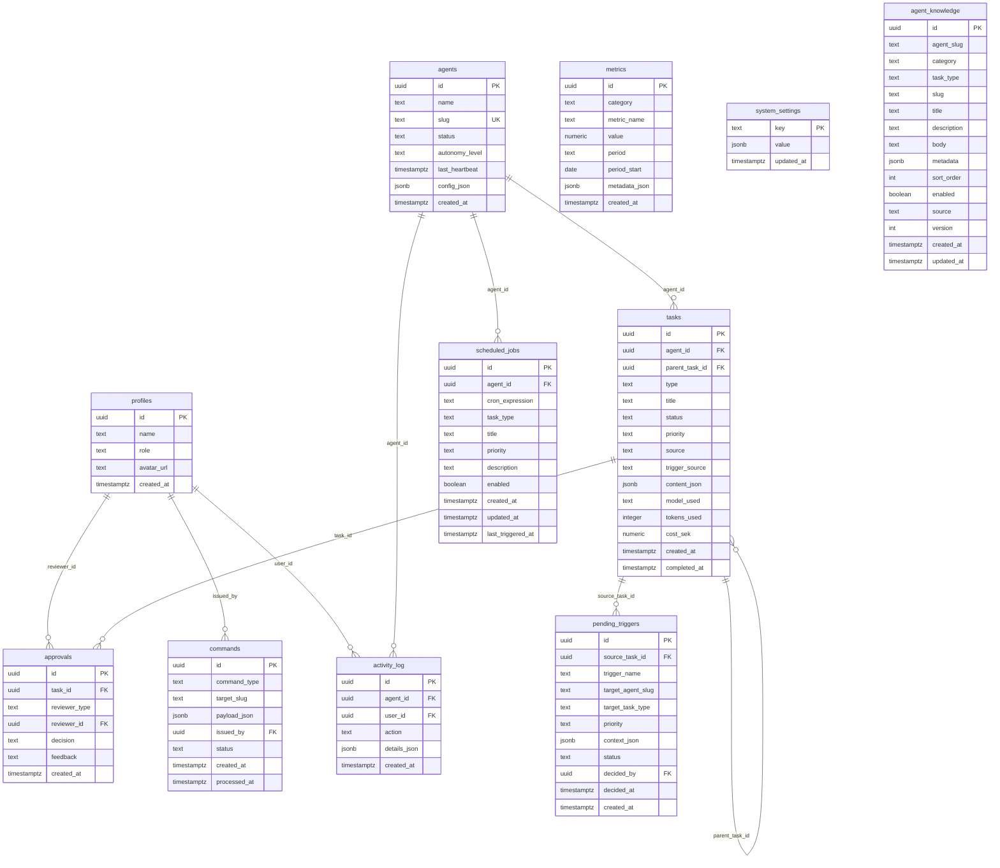

# Datamodell

FIA använder Supabase PostgreSQL (EU-region) som central databas. Gateway skriver via service role key (kringgår RLS), medan Dashboard och CLI läser via Supabase Auth (JWT) respektive FIA_CLI_TOKEN.

## ER-diagram



## Tabellscheman

### profiles

Användarprofiler länkade 1:1 med `auth.users`. Skapas automatiskt via trigger vid registrering.

```sql
CREATE TABLE profiles (
  id         uuid PRIMARY KEY REFERENCES auth.users(id) ON DELETE CASCADE,
  name       text NOT NULL,
  role       text NOT NULL DEFAULT 'viewer'
               CHECK (role IN ('orchestrator', 'admin', 'viewer')),
  avatar_url text,
  created_at timestamptz NOT NULL DEFAULT now()
);
```

| Roll | Behörighet |
|------|-----------|
| `orchestrator` | Full access – godkänna, konfigurera, kill switch |
| `admin` | Teknik + konfiguration |
| `viewer` | Skrivskyddad |

### agents

Register över FIA:s 8 agenter. Gateway skriver heartbeats, Dashboard läser status.

```sql
CREATE TABLE agents (
  id              uuid PRIMARY KEY DEFAULT gen_random_uuid(),
  name            text NOT NULL,
  slug            text NOT NULL UNIQUE CHECK (slug ~ '^[a-z][a-z0-9_-]*$'),
  status          text NOT NULL DEFAULT 'idle'
                    CHECK (status IN ('active', 'paused', 'error', 'idle')),
  autonomy_level  text NOT NULL
                    CHECK (autonomy_level IN ('autonomous', 'semi-autonomous', 'manual')),
  last_heartbeat  timestamptz,
  config_json     jsonb DEFAULT '{}'::jsonb,
  created_at      timestamptz NOT NULL DEFAULT now()
);
```

### tasks

Alla uppgifter producerade av agenter. Central tabell för godkännandeflödet.

```sql
CREATE TABLE tasks (
  id              uuid PRIMARY KEY DEFAULT gen_random_uuid(),
  agent_id        uuid NOT NULL REFERENCES agents(id) ON DELETE CASCADE,
  parent_task_id  uuid REFERENCES tasks(id),
  type            text NOT NULL,
  title           text NOT NULL,
  status          text NOT NULL DEFAULT 'queued'
                    CHECK (status IN (
                      'queued', 'in_progress', 'completed',
                      'awaiting_review', 'approved', 'rejected', 'revision_requested',
                      'delivered', 'activated', 'triggered', 'acknowledged',
                      'live', 'paused_task', 'ended',
                      'published', 'error'
                    )),
  priority        text NOT NULL DEFAULT 'normal'
                    CHECK (priority IN ('low', 'normal', 'high', 'urgent')),
  source          text,
  trigger_source  text,
  content_json    jsonb DEFAULT '{}'::jsonb,
  model_used      text,
  tokens_used     integer,
  cost_sek        numeric(10, 4),
  created_at      timestamptz NOT NULL DEFAULT now(),
  completed_at    timestamptz
);
```

!!! info "Self-referencing"
    `parent_task_id` möjliggör task-relationer. En trigger kan skapa en child-task som refererar till den task som utlöste den. Detta ger full lineage-spårning.

### approvals

Granskningshistorik per task. Både Brand Agent-granskningar och mänskliga godkännanden.

```sql
CREATE TABLE approvals (
  id            uuid PRIMARY KEY DEFAULT gen_random_uuid(),
  task_id       uuid NOT NULL REFERENCES tasks(id) ON DELETE CASCADE,
  reviewer_type text NOT NULL
                  CHECK (reviewer_type IN ('brand_agent', 'orchestrator', 'admin', 'ledningsgrupp')),
  reviewer_id   uuid REFERENCES profiles(id),
  decision      text NOT NULL
                  CHECK (decision IN ('approved', 'rejected', 'revision_requested')),
  feedback      text,
  created_at    timestamptz NOT NULL DEFAULT now()
);
```

### feedback

Feedback-tabell för ackumulerad återkoppling till agenter.

### metrics

KPI-data per period. Analytics Agent skriver, Dashboard visualiserar.

```sql
CREATE TABLE metrics (
  id            uuid PRIMARY KEY DEFAULT gen_random_uuid(),
  category      text NOT NULL
                  CHECK (category IN ('content', 'traffic', 'leads', 'cost', 'brand')),
  metric_name   text NOT NULL,
  value         numeric NOT NULL,
  period        text NOT NULL CHECK (period IN ('daily', 'weekly', 'monthly')),
  period_start  date NOT NULL,
  metadata_json jsonb DEFAULT '{}'::jsonb,
  created_at    timestamptz NOT NULL DEFAULT now(),

  CONSTRAINT metrics_unique_per_period
    UNIQUE (category, metric_name, period, period_start)
);
```

### activity_log

Audit trail – varje agentbeslut och mänsklig handling loggas.

```sql
CREATE TABLE activity_log (
  id           uuid PRIMARY KEY DEFAULT gen_random_uuid(),
  agent_id     uuid REFERENCES agents(id) ON DELETE SET NULL,
  user_id      uuid REFERENCES profiles(id) ON DELETE SET NULL,
  action       text NOT NULL,
  details_json jsonb DEFAULT '{}'::jsonb,
  created_at   timestamptz NOT NULL DEFAULT now()
);
```

### commands

Dashboard → Gateway-kommunikation via Supabase Realtime.

```sql
CREATE TABLE commands (
  id            uuid PRIMARY KEY DEFAULT gen_random_uuid(),
  command_type  text NOT NULL,
  target_slug   text,
  payload_json  jsonb DEFAULT '{}'::jsonb,
  issued_by     uuid REFERENCES profiles(id),
  status        text NOT NULL DEFAULT 'pending',
  created_at    timestamptz NOT NULL DEFAULT now(),
  processed_at  timestamptz
);
```

### system_settings

Systemkonfiguration inklusive kill switch-status.

### pending_triggers

Trigger-kö för godkännande innan exekvering.

```sql
CREATE TABLE pending_triggers (
  id                uuid PRIMARY KEY DEFAULT gen_random_uuid(),
  source_task_id    uuid NOT NULL REFERENCES tasks(id),
  trigger_name      text NOT NULL,
  target_agent_slug text NOT NULL,
  target_task_type  text NOT NULL,
  priority          text NOT NULL DEFAULT 'normal',
  context_json      jsonb DEFAULT '{}',
  status            text NOT NULL DEFAULT 'pending',
  decided_by        uuid REFERENCES profiles(id),
  decided_at        timestamptz,
  created_at        timestamptz NOT NULL DEFAULT now()
);
```

### scheduled_jobs

Schemalagda jobb per agent. Seedad vid startup, konfigurerbar via Dashboard.

```sql
CREATE TABLE scheduled_jobs (
  id                uuid PRIMARY KEY DEFAULT gen_random_uuid(),
  agent_id          uuid NOT NULL REFERENCES agents(id) ON DELETE CASCADE,
  cron_expression   text NOT NULL,
  task_type         text NOT NULL,
  title             text NOT NULL,
  priority          text NOT NULL DEFAULT 'normal',
  description       text,
  enabled           boolean NOT NULL DEFAULT true,
  created_at        timestamptz NOT NULL DEFAULT now(),
  updated_at        timestamptz NOT NULL DEFAULT now(),
  last_triggered_at timestamptz DEFAULT NULL,

  CONSTRAINT scheduled_jobs_agent_task_cron_uniq
    UNIQUE (agent_id, task_type, cron_expression)
);
```

### agent_knowledge

Kunskapsbibliotek – alla agent-kunskapsobjekt (skills, kontext, few-shot, minne).

```sql
CREATE TABLE agent_knowledge (
  id          uuid PRIMARY KEY DEFAULT gen_random_uuid(),
  agent_slug  text NOT NULL,
  category    text NOT NULL
                CHECK (category IN ('skill', 'system_context', 'task_context', 'few_shot', 'memory')),
  task_type   text NOT NULL DEFAULT '',
  slug        text NOT NULL,
  title       text NOT NULL,
  description text DEFAULT '',
  body        text NOT NULL DEFAULT '',
  metadata    jsonb DEFAULT '{}',
  sort_order  int NOT NULL DEFAULT 0,
  enabled     boolean NOT NULL DEFAULT true,
  source      text NOT NULL DEFAULT 'yaml',
  version     int NOT NULL DEFAULT 1,
  created_by  uuid REFERENCES auth.users(id),
  updated_by  uuid REFERENCES auth.users(id),
  created_at  timestamptz NOT NULL DEFAULT now(),
  updated_at  timestamptz NOT NULL DEFAULT now()
);

-- Unikt index för upsert
CREATE UNIQUE INDEX idx_ak_agent_category_tasktype_slug
  ON agent_knowledge (agent_slug, category, task_type, slug);
```

## content_json-schema

Standardiserat JSON-schema för task-innehåll:

```json
{
  "content_type": "blog_post",
  "title": "Framtidens marknadsföring med AI-agenter",
  "body": "## Inledning\n\nI en värld där...",
  "summary": "En genomgång av hur AI-agenter förändrar marknadsarbetet.",
  "media": [
    {
      "type": "image",
      "url": "https://storage.example.com/hero.png",
      "alt_text": "AI-agent illustration"
    }
  ],
  "channel_hints": ["blog", "linkedin"],
  "metadata": {
    "word_count": 1200,
    "reading_time_min": 5,
    "seo_keywords": ["AI-agenter", "marknadsautomation"],
    "target_persona": "CMO",
    "brand_score": 0.92,
    "self_eval_score": 0.85
  }
}
```

## Migreringshistorik

| # | Fil | Beskrivning |
|---|-----|-------------|
| 001 | `001_initial_schema.sql` | Grundschema: profiles, agents, tasks, approvals, metrics, activity_log + RLS |
| 002 | `002_remove_task_type_check.sql` | Borttagning av strikt task type-kontroll |
| 003 | `003_add_error_status.sql` | Lägg till `error` i tasks.status |
| 004 | `004_add_source_and_metrics_constraint.sql` | source-kolumn + metrics upsert-constraint |
| 005 | `005_fix_metrics_constraint.sql` | Fix av metrics constraint |
| 006 | `006_add_update_task_status_fn.sql` | Funktion för statusuppdatering |
| 007 | `007_drop_cost_ledger_trigger.sql` | Ta bort cost ledger-trigger |
| 008 | `008_add_commands_table.sql` | Commands-tabell för Dashboard → Gateway |
| 009 | `009_add_intelligence_agent.sql` | Lägg till Intelligence Agent |
| 010 | `010_add_operator_role.sql` | Lägg till operator-roll |
| 011 | `011_backfill_agent_config_json.sql` | Backfill config_json för alla agenter |
| 012 | `012_nullable_commands_issued_by.sql` | Gör commands.issued_by nullable |
| 013 | `013_extended_task_status_and_triggers.sql` | 17 statusar + pending_triggers-tabell |
| 014 | `014_seed_scheduled_jobs.sql` | Schemalagda jobb + seed (10 jobb) |
| 015 | `015_agent_knowledge.sql` | agent_knowledge-tabell |
| 016 | `016_fix_agent_knowledge_upsert_index.sql` | Fix upsert-index (funktionellt → vanligt) |

## RLS-policyer

Row Level Security är aktiverat på **alla** tabeller. Principen:

| Operation | Behörighet |
|-----------|-----------|
| **SELECT** | Alla autentiserade användare (`auth.uid() IS NOT NULL`) |
| **INSERT** | `orchestrator` och `admin` (via `profiles.role`) |
| **UPDATE** | `orchestrator` och `admin` |
| **DELETE** | Ej tillåtet via RLS (hanteras via CASCADE) |

!!! warning "Service Role Key"
    Gateway använder Supabase service role key som kringgår RLS helt. Detta är nödvändigt för att agenter ska kunna skriva tasks, heartbeats och aktivitetsloggar utan autentisering.

## Realtime-prenumerationer

Följande tabeller har Realtime aktiverat för live-uppdateringar i Dashboard:

| Tabell | Prenumerant | Syfte |
|--------|------------|-------|
| `agents` | Dashboard | Agentstatus, heartbeat |
| `tasks` | Dashboard, CLI (tail/watch) | Task-status, nya tasks |
| `activity_log` | Dashboard, CLI (tail) | Live aktivitetslogg |
| `commands` | Gateway | Dashboard → Gateway-kommandon |
| `system_settings` | Dashboard, Gateway | Kill switch-status |
| `feedback` | Dashboard | Ny feedback |
| `pending_triggers` | Dashboard | Trigger-godkännandekö |
