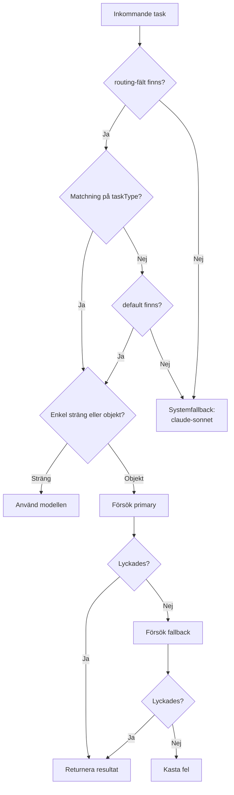

# LLM-routing

FIA använder manifest-driven modellrouting. Varje agents `agent.yaml` definierar vilken LLM-modell som ska användas per uppgiftstyp. Ingen modellreferens hårdkodas i TypeScript.

## Modeller

| Modell | Alias | Användning | Pris (in) | Pris (ut) |
|--------|-------|-----------|-----------|-----------|
| Claude Opus 4.6 | `claude-opus` | Innehåll, strategi, analys, Brand Agent-granskning | $15 / 1M tokens | $75 / 1M tokens |
| Claude Sonnet 4.6 | `claude-sonnet` | Metadata, scoring, klassificering, A/B-varianter | $3 / 1M tokens | $15 / 1M tokens |
| Gemini 2.5 Pro | `gemini-pro` | Fallback för text, djupanalys | $1.25 / 1M tokens | $10 / 1M tokens |
| Gemini 2.5 Flash | `gemini-flash` | Fallback för text, snabba uppgifter | $0.15 / 1M tokens | $0.60 / 1M tokens |
| Nano Banana 2 | `nano-banana-2` | Bildgenerering (via Gemini API) | ~$0.04 / bild | – |
| Serper API | `google-search` | Realtidssökning, trendspaning | $0.001 / sökning | – |

!!! tip "Kostnadsstyrning"
    Sonnet används för uppgifter där Opus-kvalitet inte krävs (metadata, scoring, self-eval). Detta minskar LLM-kostnaden avsevärt – Sonnet kostar 5x mindre per token.

## Modellalias-mappning

Routern mappar alias i `agent.yaml` till faktiska modell-ID:n:

| Alias | Modell-ID |
|-------|-----------|
| `claude-opus` | `claude-opus-4-6` |
| `claude-sonnet` | `claude-sonnet-4-6` |
| `gemini-pro` | `gemini-2.5-pro` |
| `gemini-flash` | `gemini-2.5-flash` |
| `nano-banana-2` | `gemini-2.0-flash-exp` (image mode) |
| `google-search` | Serper.dev REST API |

## Routing-logik

### agent.yaml routing-fält

Varje agent definierar ett `routing`-fält som mappar uppgiftstyp till modellalias:

```yaml
# Content Agent
routing:
  default: claude-opus       # Standardmodell
  metadata: claude-sonnet    # Metadata-generering
  alt_text: claude-sonnet    # Alt-texter för bilder
  ab_variants: claude-sonnet # A/B-varianter
  images: nano-banana-2      # Bildgenerering
```

```yaml
# Lead Agent
routing:
  default: claude-sonnet     # Scoring kräver ej Opus
  deep_analysis: claude-opus # Djupanalys av leads
```

### Resolving

Routern väljer modell i följande ordning:

1. **Exakt matchning** – Om `routing[taskType]` finns, använd den
2. **Default** – Om ingen matchning, använd `routing.default`
3. **Systemfallback** – Om inget `routing`-fält, använd `claude-sonnet`

## Fallback-system

Routing-poster kan vara en enkel sträng eller ett objekt med primär och fallback-modell:

=== "Enkel routing"

    ```yaml
    routing:
      default: claude-opus
    ```

=== "Routing med fallback"

    ```yaml
    routing:
      default:
        primary: claude-opus
        fallback: gemini-pro
      metadata:
        primary: claude-sonnet
        fallback: gemini-flash
    ```

### resolveRouteWithFallback()



!!! info "Fallback-logik"
    Fallback aktiveras vid nätverksfel, rate limiting eller API-otillgänglighet – **inte** vid dålig outputkvalitet. Kvalitetskontroll sker via self-eval och Brand Agent.

## Strukturerad output via tool_use

FIA använder Anthropic `tool_use` (function calling) för att få strukturerad JSON-output från LLM-anrop. Fyra verktyg definieras:

| Verktyg | Användning | Agent |
|---------|-----------|-------|
| `content_response` | Strukturerat innehåll (titel, body, metadata) | Content, Campaign |
| `brand_review_decision` | Granskningsbeslut (approved/rejected + feedback) | Brand |
| `signal_scoring` | Poängsättning av signaler/leads | Intelligence, Lead |
| `deep_analysis` | Djupanalys med resonemang och rekommendationer | Strategy, Analytics |

### Exempel: content_response

```json
{
  "name": "content_response",
  "input": {
    "content_type": "blog_post",
    "title": "Hur AI förändrar B2B-marknadsföring",
    "body": "## Inledning\n\n...",
    "summary": "En analys av AI-trender inom B2B.",
    "channel_hints": ["blog", "linkedin"],
    "metadata": {
      "word_count": 1400,
      "seo_keywords": ["AI", "B2B", "marknadsföring"],
      "self_eval_score": 0.88
    }
  }
}
```

### Exempel: brand_review_decision

```json
{
  "name": "brand_review_decision",
  "input": {
    "decision": "approved",
    "score": 0.92,
    "feedback": "Tonaliteten är träffsäker. Bra användning av aktivt språk.",
    "issues": []
  }
}
```
