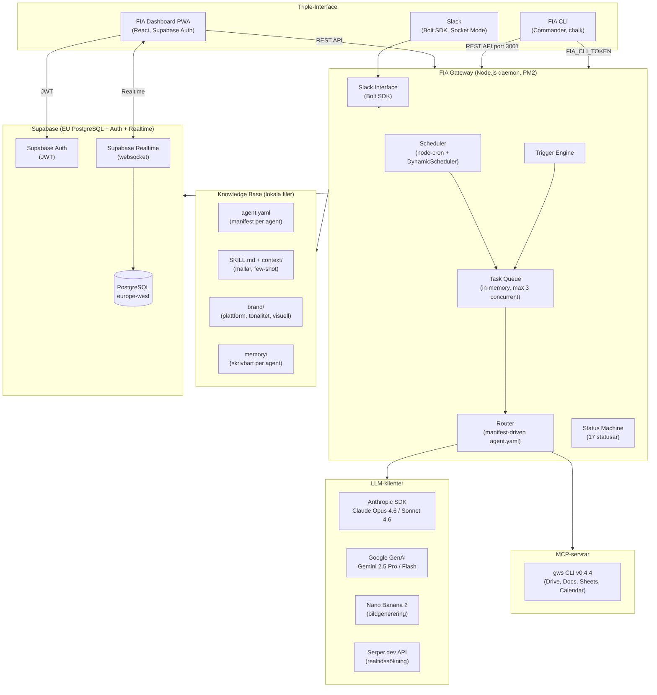
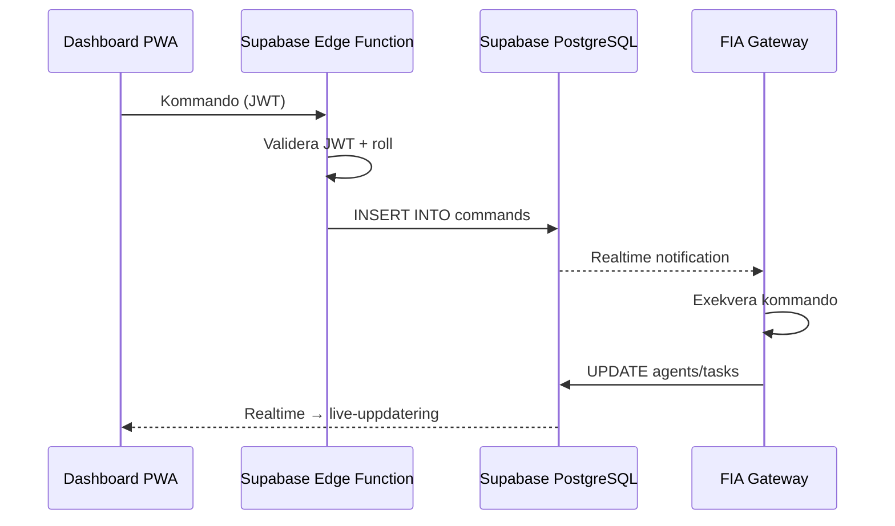

# Systemöversikt

FIA (Forefront Intelligent Automation) är en AI-agentgateway som ersätter Forefronts marknadsavdelning. Sju agentkluster utför operativt marknadsarbete under styrning av 1–2 Marketing Orchestrators.

## Arkitekturdiagram

## Komponenttabell

| Komponent          | Teknologi                                    |
| ------------------ | -------------------------------------------- |
| **Runtime**        | Node.js daemon via PM2                       |
| **Språk**          | TypeScript (strict mode)                     |
| **Scheduler**      | node-cron + DynamicScheduler                 |
| **Task Queue**     | In-memory priority queue, max 3 concurrent   |
| **Slack**          | Bolt SDK, Socket Mode                        |
| **Router**         | Manifest-driven via `agent.yaml`             |
| **LLM primär**     | Anthropic SDK – Claude Opus 4.6 / Sonnet 4.6 |
| **LLM fallback**   | Google GenAI – Gemini 2.5 Pro / Flash        |
| **Bildgenerering** | Nano Banana 2 via Gemini API                 |
| **Sökning**        | Serper.dev API                               |
| **Kontext**        | agent.yaml + markdown + JSON                 |
| **Skills**         | Modulära (`shared:` + `agent:`)              |
| **Loggning**       | Strukturerad JSON → Supabase `activity_log`  |
| **Databas**        | @supabase/supabase-js                        |
| **Realtime**       | Supabase Realtime (websocket)                |
| **REST API**       | Express, intern port 3001                    |
| **CLI**            | Commander + chalk + boxen + ora + cli-table3 |
| **Validering**     | Zod                                          |
| **Status Machine** | `status-machine.ts` (17 statusar)            |
| **Trigger Engine** | `trigger-engine.ts` (deklarativ)             |
| **GWS**            | gws CLI v0.4.4 via MCP                       |
| **Hosting**        | GCP Compute Engine europe-north1-b           |

## Designprinciper

### Human on the Loop

Agenter beslutar och exekverar inom definierade ramar. Orchestratorn sätter riktning och godkänner – men behöver inte styra varje steg. Systemet är designat för att köra autonomt med mänsklig uppsikt, inte mänsklig styrning.

### Manifest-driven agents

Varje agent styrs av sin `agent.yaml` – modellval, kontextladdning, verktyg, autonominivå och triggers. Ingen hårdkodning i TypeScript. Beteendeförändringar görs i YAML, inte i kod.

### Headless arkitektur

Frontend och backend är fullständigt separerade. Dashboard PWA kommunicerar **aldrig** direkt med gateway-processen.

!!! info "Kommunikationsvägar" - **REST API** – Dashboard och CLI anropar `/api/*` endpoints (port 3001) - **Supabase Auth** – JWT-validering för Dashboard-användare - **Supabase Realtime** – Websocket-prenumerationer för live-uppdateringar - **Commands-tabell** – Dashboard skriver kommandon, Gateway lyssnar via Realtime

### Triple-Interface

FIA exponeras genom tre parallella gränssnitt:

| Gränssnitt        | Användning                                  | Teknik                   |
| ----------------- | ------------------------------------------- | ------------------------ |
| **Slack**         | Kommandon, notifieringar, eskaleringar      | Bolt SDK, Socket Mode    |
| **Dashboard PWA** | Grafisk vy, godkännandekö, KPI, kill switch | React, Supabase Realtime |
| **FIA CLI**       | Terminalverktyg för SSH/lokal access        | Commander, chalk         |

!!! note "Ingen gateway-exponering"
Gateway-processen är **inte** exponerad mot internet. Slack använder Socket Mode (utgående websocket), Dashboard går via Supabase, och CLI ansluter till intern port 3001.
