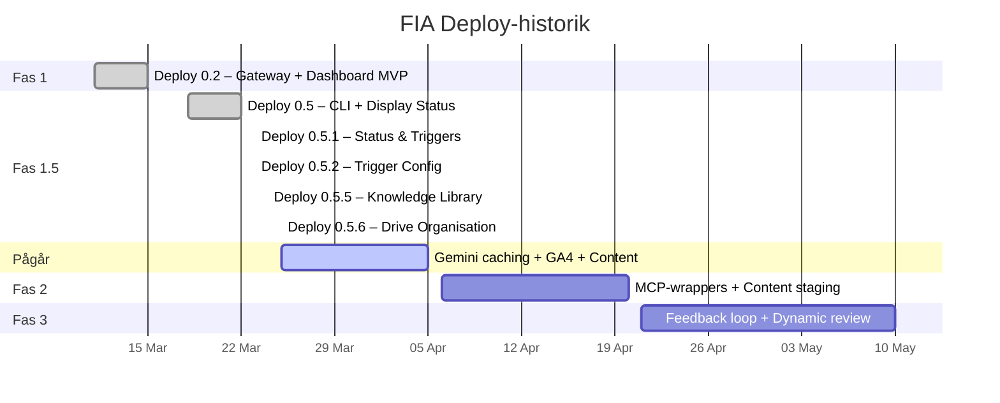

# Roadmap

FIA utvecklas iterativt i deploy-faser. Projektet drivs av en person med Claude Code (gateway) och Lovable (Dashboard PWA).

## Tidslinje

---

## Deploy 0.2 – Gateway + Dashboard MVP

**Datum:** 2026-03-15 | **Tidsåtgång:** 4 arbetsdagar | **Team:** 1 person + Claude Code + Lovable

!!! success "Levererat"
Komplett gateway-skelett och fungerande Dashboard PWA med live-data.

| Leverans             | Detalj                                                     |
| -------------------- | ---------------------------------------------------------- |
| Gateway-skelett      | Node.js daemon, PM2, TypeScript strict                     |
| Slack-integration    | Bolt SDK, Socket Mode, kommandon                           |
| Supabase-uppsättning | 6 tabeller, RLS, Realtime                                  |
| LLM-klienter         | Anthropic SDK (Claude), Gemini, Serper                     |
| Modell-router        | Manifest-driven routing via agent.yaml                     |
| Kontexthantering     | Prompt-builder med system/task-kontext                     |
| Content Agent        | Full textproduktion med Brand Agent-granskning             |
| Brand Agent          | Vetorätt, alltid Opus, granskningskriterier                |
| REST API             | Express, intern port 3001                                  |
| Schemaläggning       | node-cron, DynamicScheduler                                |
| Kill switch          | Slack + Dashboard, audit trail                             |
| Claude API-migration | Migrerat från Gemini som primär LLM                        |
| Alla 7 agenter       | Strategy, Content, Campaign, SEO, Lead, Analytics, Brand   |
| Testsvit             | 13 testfiler: router, brand-agent, agent-loader, m.fl.     |
| Dashboard MVP        | Auth, agentpuls, godkännandekö, kill switch, Realtime      |
| Self-eval            | Scoring, parallel pre-screening, exponential backoff retry |

---

## Deploy 0.5 – CLI + Display Status

**Datum:** 2026-03-22 | **Tidsåtgång:** 4 arbetsdagar

!!! success "Levererat"
FIA CLI-klient med 11 kommandon och enhetlig display-status i alla tre gränssnitt.

| Leverans               | Detalj                                                                                             |
| ---------------------- | -------------------------------------------------------------------------------------------------- |
| FIA Display Status     | `src/shared/display-status.ts` – 5 statusar med resolve-logik                                      |
| FIA CLI                | 11 kommandon: status, agents, run, queue, approve, reject, kill, resume, logs, tail, watch, config |
| CLI auth middleware    | FIA_CLI_TOKEN-bypass (admin-roll, skippar JWT)                                                     |
| POST /api/tasks        | Nytt endpoint för task-skapande från CLI/Dashboard                                                 |
| Status-filter          | Kommaseparerade filter i GET /api/tasks                                                            |
| Forefront Earth-palett | Varumärkesfärger i CLI-output                                                                      |
| CLI-tester             | 3 testfiler, 25 tester                                                                             |
| gws MCP                | Kopplad till agenter via @alanse/mcp-server-google-workspace                                       |
| CI/CD                  | GitHub Actions (`.github/workflows/ci.yml`)                                                        |
| ESLint + Prettier      | `eslint.config.mjs`, `.prettierrc`                                                                 |
| Teknisk skuld B1–B12   | Alla 12 backend-fixar åtgärdade                                                                    |

---

## Deploy 0.5.1 – Task Status & Trigger Engine

**Datum:** 2026-03-23

!!! success "Levererat"
Utökad statusmodell med 17 statusar och deklarativ trigger engine.

| Leverans                | Detalj                                               |
| ----------------------- | ---------------------------------------------------- |
| Statusmodell            | 17 statusar med statusmaskin och övergångsvalidering |
| Trigger Engine          | Deklarativ, 7 triggers i 4 agenter                   |
| pending_triggers        | Ny tabell med godkännandekö i Dashboard              |
| Task-relationer         | `parent_task_id`, children, lineage                  |
| Dashboard-uppdateringar | TaskStatusBadge, TriggersPage, task-relationer       |

---

## Deploy 0.5.2 – Trigger-konfiguration

**Datum:** 2026-03-23

!!! success "Levererat"
Trigger-konfiguration flyttad till Dashboard med reseed-möjlighet.

| Leverans              | Detalj                                                        |
| --------------------- | ------------------------------------------------------------- |
| Trigger-konfiguration | Visa, enable/disable, redigera triggers per agent i Dashboard |
| config_json.triggers  | Trigger engine läser från Supabase istället för agent.yaml    |
| Seed-logik            | config_json.triggers seedas vid gateway-startup               |
| TriggersConfigPage    | Systemövergripande trigger-översikt med filter                |
| Reseed från YAML      | Dry-run diff + bekräftelsedialog (admin only)                 |
| Nya API-endpoints     | 4 nya endpoints för trigger-konfiguration                     |
| React-komponenter     | 11 nya komponenter                                            |
| i18n                  | 40+ nya översättningsnycklar                                  |

---

## Deploy 0.5.5 – Knowledge Library

**Datum:** 2026-03-24

!!! success "Levererat"
Knowledge Library med seeder och Dashboard-integration.

| Leverans                | Detalj                                                                 |
| ----------------------- | ---------------------------------------------------------------------- |
| Knowledge Library       | Kunskapsseeder: skills, system_context, task_context, few_shot, memory |
| Brand context           | Seedas som delad system_context (`knowledge/brand/*.md`)               |
| Few-shot-kategorisering | Few-shot-filer kategoriseras korrekt (inte task_context)               |
| reseed_knowledge        | Command i command-listener (Dashboard → Gateway)                       |
| Dashboard-knapp         | "Populera från server" (admin only)                                    |
| Upsert-fix              | Funktionellt unikt index → vanligt unikt index                         |
| Felhantering            | `emitCommand` returnerar fel för Dashboard-visning                     |

---

## Deploy 0.5.6 – Drive Organisation

**Datum:** 2026-03-25

!!! success "Levererat"
Google Drive-mappstruktur och CLI-verktyg för agenter.

| Leverans                | Detalj                                                               |
| ----------------------- | -------------------------------------------------------------------- |
| Drive setup-service     | Idempotent skapande/verifiering av mappar, folder-IDs i Supabase     |
| CLI-kommando            | `fia drive setup [--dry-run]` + `fia drive status`                   |
| API-endpoints           | `GET /api/drive/status` + `POST /api/drive/setup`                    |
| Agent-kontext           | Auto-genererade `drive-folders.md` med folder-IDs per agent          |
| Utökade agentverktyg    | `gws:drive` tillagt på Strategy och SEO agenter                      |
| Deklarativ mappstruktur | `src/mcp/drive-structure.ts` med trädstruktur och agent→mapp-mapping |
| googleapis global auth  | `ensureGlobalAuth()` sätter `google.options({ auth })` + refresh     |
| MCP isError-detektion   | `gws.ts` kastar errors vid `{ isError: true }` från MCP-verktyg      |
| MCP svar-parsning       | Folder-ID extraheras ur formaterad text (inte bara enkel JSON)       |
| OAuth auth-script       | `expiry_date` (timestamp), full `drive`-scope, Desktop App-stöd      |

---

## Pågår

| Uppgift                | Status                          | Beskrivning                                         |
| ---------------------- | ------------------------------- | --------------------------------------------------- |
| Gemini context caching | :material-progress-clock: Pågår | Cacha system-kontext för minskad latens och kostnad |
| GA4 Analytics API      | :material-progress-clock: Pågår | Anslut Analytics Agent till Google Analytics 4      |
| 10 innehållsenheter    | :material-progress-clock: Pågår | Producera 10 st publicerbart innehåll               |

---

## Fas 2 – MCP-wrappers + Content Staging

!!! abstract "Planerat"
Fullständiga MCP-integrationer och validerad content pipeline.

| Uppgift         | Beskrivning                                        |
| --------------- | -------------------------------------------------- |
| HubSpot MCP     | CRM-integration: kontakter, deals, pipelines       |
| LinkedIn MCP    | Publicering, analytics, company page               |
| Buffer MCP      | Social media-schemaläggning och publicering        |
| Content staging | Zod-validering av `content_json` innan publicering |

Alla MCP-wrappers implementeras i `src/mcp/` med principen tunn wrapper (50–200 rader) och minsta möjliga rättighet.

---

## Fas 3 – Feedback Loop + Dynamic Review

!!! abstract "Planerat"
Självförbättrande system med dynamisk granskningsfrekvens.

| Uppgift                 | Beskrivning                                                         |
| ----------------------- | ------------------------------------------------------------------- |
| Feedback loop           | Systematisk insamling och analys av feedback per agent              |
| Dynamic review rate     | `sample_review_rate` justeras automatiskt baserat på agent-kvalitet |
| Few-shot avoid examples | Underkänt innehåll sparas som negativa few-shot-exempel             |
| Agent memory evolution  | Agenter uppdaterar sin `memory/learnings.json` baserat på feedback  |
