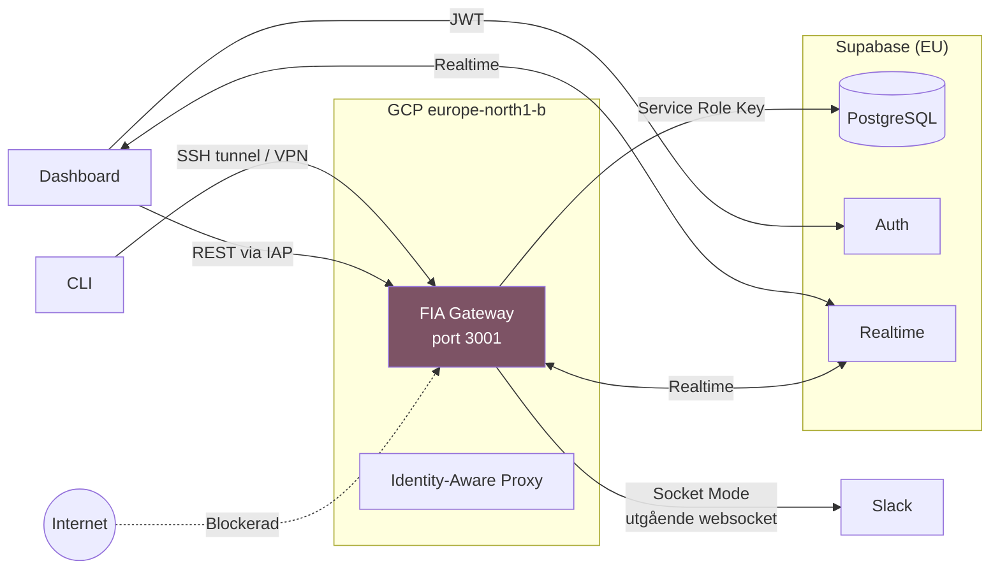
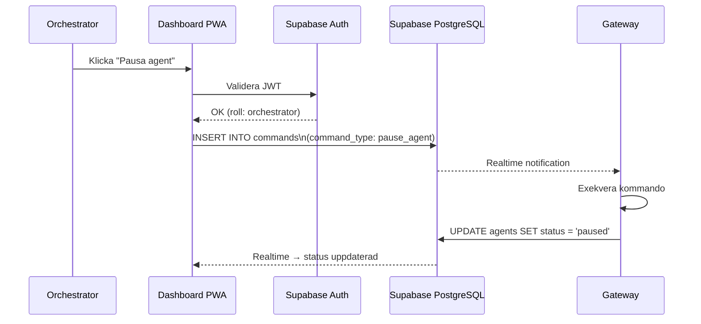
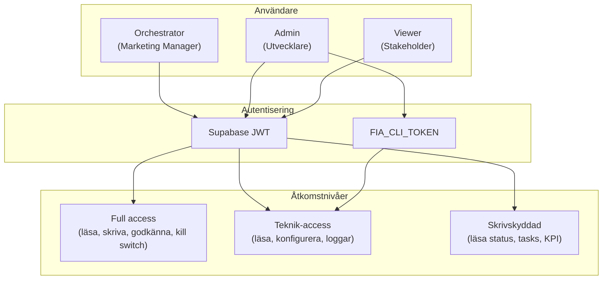

# Säkerhet

FIA:s säkerhetsmodell bygger på lagerbaserat skydd: nätverksisolering, autentisering, auktorisering, dataskydd och auditering.

## API-nycklar och hemligheter

Alla hemligheter lagras i `.env`-filen på gateway-servern. Aldrig i kod, aldrig i frontend.

| Nyckel                      | Syfte                  | Exponering                         |
| --------------------------- | ---------------------- | ---------------------------------- |
| `ANTHROPIC_API_KEY`         | Claude API-anrop       | Enbart gateway                     |
| `GEMINI_API_KEY`            | Gemini / Nano Banana 2 | Enbart gateway                     |
| `SLACK_BOT_TOKEN`           | Slack Bot              | Enbart gateway                     |
| `SLACK_APP_TOKEN`           | Slack Socket Mode      | Enbart gateway                     |
| `SUPABASE_URL`              | Supabase-instans       | Gateway + Dashboard (publik)       |
| `SUPABASE_SERVICE_ROLE_KEY` | Supabase admin-access  | Enbart gateway                     |
| `SUPABASE_ANON_KEY`         | Supabase publik nyckel | Dashboard (publik, skyddas av RLS) |
| `SERPER_API_KEY`            | Google Search          | Enbart gateway                     |
| `FIA_CLI_TOKEN`             | CLI-autentisering      | Gateway + CLI                      |

!!! danger "Service Role Key"
`SUPABASE_SERVICE_ROLE_KEY` kringgår all RLS. Den finns **enbart** på gateway-servern och ska aldrig exponeras i frontend eller loggar.

## Nätverksisolering

### Gateway exponeras INTE mot internet



| Gränssnitt    | Nätverksåtkomst                                                          |
| ------------- | ------------------------------------------------------------------------ |
| **Slack**     | Socket Mode – gateway initierar utgående websocket (ingen ingående port) |
| **Dashboard** | Kommunicerar via Supabase (Auth + Realtime) och REST API via IAP         |
| **CLI**       | Kräver SSH-tunnel eller VPN till gateway-servern                         |
| **REST API**  | Bunden till localhost:3001, ej exponerad externt                         |

## Dashboard-kommandon

Dashboard skickar **aldrig** kommandon direkt till gateway. Alla kommandon flödar via commands-tabellen:



!!! info "Audit trail"
Varje kommando loggas i `commands`-tabellen med `issued_by`, `command_type`, `target_slug` och tidsstämpel. Inget kommando kan exekveras utan spårbarhet.

## Minsta möjliga rättighet

### Per agent

Varje agent har begränsade rättigheter definierade i `agent.yaml`:

- **`tools`** – Enbart listade MCP-verktyg är tillgängliga
- **`writable`** – Enbart listade filer kan skrivas
- **`autonomy`** – Styr om agenten kan agera självständigt

### Per MCP-server

```yaml
# Content Agent – begränsade GWS-rättigheter
tools:
  - "gws:drive" # Enbart Drive
  - "gws:docs" # Enbart Docs
  - buffer # Social media-publicering
```

### GWS Service Account

Google Workspace-access via OAuth (gws CLI v0.4.4). Varje tjänst begränsas till minsta möjliga scope.

## Kill Switch

Dubbel kill switch – kan aktiveras från **både** Slack och Dashboard:

| Egenskap           | Detalj                                                                  |
| ------------------ | ----------------------------------------------------------------------- |
| **Aktivering**     | Slack: `/fia kill` · Dashboard: Kill Switch-knapp · CLI: `npx fia kill` |
| **Effekt**         | Alla agenter stoppas omedelbart. Inga nya tasks startas.                |
| **Lagring**        | `system_settings`-tabellen (key: `kill_switch`)                         |
| **Audit trail**    | Loggas i `activity_log` med vem som aktiverade                          |
| **Återaktivering** | Kräver `orchestrator`- eller `admin`-roll                               |

!!! danger "Kill switch stoppar allt"
När kill switch är aktiv:

    - Inga nya tasks köas
    - Pågående tasks avbryts vid nästa checkpoint
    - Alla agenters display-status sätts till `killed`
    - Schedulern pausas
    - Trigger engine stoppas

## Row Level Security (RLS)

RLS är aktiverat på **alla** Supabase-tabeller. Se [Datamodell → RLS-policyer](data-model.md#rls-policyer) för detaljer.

Grundprincip:

- **Alla autentiserade** kan läsa (SELECT)
- **Orchestrator + Admin** kan skriva (INSERT/UPDATE)
- **Gateway** använder service role key (kringgår RLS)

## Autentisering

### Supabase Auth (Dashboard)

- JWT-baserad autentisering
- Inga API-nycklar i frontend
- Token-refresh hanteras av Supabase SDK
- Roller lagras i `profiles`-tabellen

### Inbjudningsbaserad registrering

Nya användare kan **enbart** registreras via inbjudan. Öppen registrering är avaktiverad i Supabase Auth-konfigurationen.

!!! note "Tre roller"
| Roll | Behörighet |
|------|-----------|
| `orchestrator` | Allt: godkänna, konfigurera, kill switch, triggers |
| `admin` | Teknik: konfigurera agenter, se loggar, hantera system |
| `viewer` | Skrivskyddad: se status, tasks, KPI |

## Datalokalitet

All data lagras inom EU:

| Komponent               | Region                                                         |
| ----------------------- | -------------------------------------------------------------- |
| **GCP Compute Engine**  | europe-north1-b (Finland)                                      |
| **Supabase PostgreSQL** | EU-region                                                      |
| **Backups**             | EU-region                                                      |
| **LLM-anrop**           | API-anrop till Anthropic/Google (data bearbetas men lagras ej) |

!!! info "GDPR"
FIA hanterar inga personuppgifter utöver användarkontons namn och e-post. Alla agenter har `shared:gdpr-compliance`-skill som guardrail.

## Strukturerad loggning

All aktivitet loggas strukturerat:

```json
{
  "agent_id": "uuid",
  "action": "task_completed",
  "details_json": {
    "task_id": "uuid",
    "task_type": "blog_post",
    "model_used": "claude-opus-4-6",
    "tokens_used": 4200,
    "cost_sek": 1.23,
    "duration_ms": 8500
  },
  "created_at": "2026-03-25T07:00:00Z"
}
```

Loggar skrivs till:

1. **Supabase `activity_log`** – Persistent, sökbar, synlig i Dashboard
2. **Lokala JSON-filer** – `logs/`-katalogen (gitignored), rotation via PM2

## Validering

Zod används för validering av:

- Alla API-request bodies
- Agent-konfiguration (`agent.yaml` → parsed med Zod)
- Task `content_json`-struktur
- Trigger-villkor och åtgärder
- CLI-indata

```typescript
// Exempel: Task creation schema
const CreateTaskSchema = z.object({
  agent_slug: z.string().regex(/^[a-z][a-z0-9_-]*$/),
  type: z.string(),
  title: z.string().min(1).max(200),
  priority: z.enum(["low", "normal", "high", "urgent"]).default("normal"),
  content_json: z.record(z.unknown()).optional(),
});
```

## IAM-struktur


