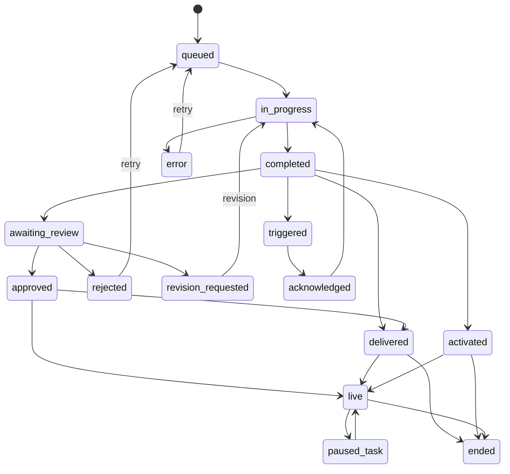
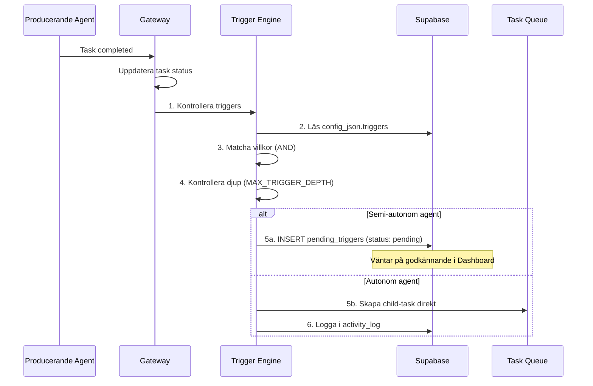

# Trigger Engine

FIA:s trigger engine möjliggör deklarativ, konfigurerbar autonomi. Agenter kan automatiskt utlösa uppföljningsuppgifter baserat på händelser i systemet.

## Designprinciper

1. **Ett enum för alla agenter** – Alla statusar definieras i en gemensam uppsättning
2. **Bakåtkompatibel** – Befintliga statusar behålls, nya läggs till
3. **Statusar beskriver task-tillstånd** – Inte affärslogik

## Statusmodell (17 statusar)



### Statusbeskrivningar

| Status | Beskrivning | Typisk agent |
|--------|-------------|-------------|
| `queued` | Väntar på exekvering | Alla |
| `in_progress` | Under bearbetning | Alla |
| `completed` | Färdig, inväntar nästa steg | Alla |
| `awaiting_review` | Väntar på granskning (Brand/Orchestrator) | Content, Campaign |
| `approved` | Godkänd av granskare | Content, Campaign |
| `rejected` | Underkänd av granskare | Content, Campaign |
| `revision_requested` | Revision begärd med feedback | Content, Campaign |
| `delivered` | Levererad till mottagare/kanal | Content, Campaign |
| `activated` | Aktiverad (kampanj, sekvens) | Campaign, Lead |
| `triggered` | Utlöst av trigger engine | Alla |
| `acknowledged` | Trigger mottagen, väntar på bearbetning | Alla |
| `live` | Aktiv och publicerad | Campaign, Content |
| `paused_task` | Temporärt pausad | Campaign |
| `ended` | Avslutad (kampanj slut, sekvens klar) | Campaign, Lead |
| `published` | *(deprecated)* Behålls för bakåtkompatibilitet | – |
| `error` | Fel vid bearbetning | Alla |

!!! warning "published är deprecated"
    Statusen `published` behålls för bakåtkompatibilitet men ska inte användas i ny kod. Använd `delivered` → `live` istället.

## Statusflöden per agenttyp

=== "Content / Campaign"

    ```
    queued → in_progress → completed → awaiting_review → approved → delivered → live → ended
    ```

=== "Analytics / Intelligence"

    ```
    queued → in_progress → completed → delivered
    ```

=== "Strategy"

    ```
    queued → in_progress → completed → awaiting_review → approved → activated
    ```

=== "Lead"

    ```
    queued → in_progress → completed → activated → live → ended
    ```

## Trigger Engine

### Deklarativ + konfigurerbar autonomi

Triggers definieras deklarativt i varje agents `agent.yaml` och seedas till `config_json.triggers` i Supabase vid gateway-startup. **Efter seed äger dashboarden konfigurationen** – ändringar görs via Dashboard UI.

```yaml
# Exempel: agent.yaml trigger-definition
triggers:
  - name: intelligence_to_content
    event: task_completed
    conditions:
      task_type: morning_scan
      output_field: signals
      score_above: 0.8
      score_field: relevance_score
    action:
      type: create_task
      target_agent: content
      task_type: blog_post
      priority: high
```

### Trigger-händelser

| Händelse | Beskrivning | Utlöses när |
|----------|-------------|-------------|
| `task_completed` | En task når status `completed` | Agent avslutar bearbetning |
| `task_approved` | En task godkänns | Brand Agent eller Orchestrator godkänner |
| `task_activated` | En task aktiveras | Kampanj eller plan aktiveras |
| `task_delivered` | En task levereras | Innehåll publicerat till kanal |
| `anomaly_detected` | Anomali upptäckt i data | Analytics Agent flaggar avvikelse |

### Villkorsmatchning (AND-logik)

Alla villkor måste uppfyllas (AND) för att en trigger ska aktiveras:

| Fält | Typ | Beskrivning |
|------|-----|-------------|
| `task_type` | `string` | Task-typ som utlöste händelsen |
| `output_field` | `string` | Fält i `content_json` att kontrollera |
| `output_value` | `string` | Förväntat värde i fältet |
| `score_above` | `number` | Minimalt poängvärde (0.0–1.0) |
| `score_field` | `string` | Fält i `content_json` som innehåller poäng |

### Trigger-åtgärder

| Typ | Beskrivning |
|-----|-------------|
| `create_task` | Skapar en ny task i kön (med `parent_task_id` → lineage) |
| `notify_slack` | Skickar notifiering till Slack-kanal |
| `escalate` | Eskalerar till Orchestrator för manuellt beslut |

### Exekveringsflöde



### Loop-skydd

!!! danger "MAX_TRIGGER_DEPTH = 3"
    Trigger engine spårar kedjans djup via `parent_task_id`. Om en trigger-kedja överskrider 3 nivåer stoppas exekveringen och en varning loggas. Detta förhindrar oändliga loopar där agenter triggar varandra.

## Aktiva triggers

| # | Trigger | Agent | Händelse | Mål-agent | Mål-task |
|---|---------|-------|----------|-----------|----------|
| 1 | `intelligence_to_content` | Intelligence | `task_completed` (morning_scan) | Content | blog_post |
| 2 | `intelligence_to_strategy` | Intelligence | `task_completed` (morning_scan) | Strategy | weekly_planning |
| 3 | `strategy_to_content` | Strategy | `task_approved` (weekly_planning) | Content | scheduled_content |
| 4 | `strategy_to_campaign` | Strategy | `task_approved` (monthly_planning) | Campaign | campaign |
| 5 | `analytics_anomaly` | Analytics | `anomaly_detected` | Strategy | weekly_planning |
| 6 | `seo_to_content` | SEO | `task_completed` (seo_audit) | Content | blog_post |
| 7 | `analytics_to_intelligence` | Analytics | `task_completed` (weekly_report) | Intelligence | weekly_intelligence |
